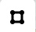

## [人工智能城市设计项目](http://10.129.2.157:8074/)
## 首页
链接作者团队的基本信息与成果，并且对版权信息进行声明。

    
     
    
首页

---

## 登录页
如果您没有登录权限，请先[create acount]()然后登录使用。

    
     
    
登录界面

---

## 选择不同模块
您可以点击不同的界面，去往不同的子模块，这里展示[人工智能城市设计]()模块。

    
     
    
选择页面

---

## 人工智能城市设计
平台首页展示路网生成的输入条件、设计方案上传、研究范围框选以及地名搜索等功能。

    
     
    
人工智能城市设计平台

点击[研究范围框选]()可以将已经有的[geojson](https://geojson.org/)格式文件上传到平台上进行展示。

    
     
    
json文件上传

点击地图中的&nbsp; 选择要框选的范围，进入下图所示的“编辑”模式，注意框选应该首尾相接。点击删除当前选择的研究范围。

    
     
    
框选研究范围

点击&nbsp; 上传研究范围，等待服务器回传研究范围内的建筑等现状信息。

    
     
    
确定框选的研究范围

通过控制鼠标的左键和右键来调整视野和呈现3D视图效果。

    
     
    
研究范围内的现状

输入要查询的地点的名称，点击名称，地图会自动跳转。

    
     
    
根据地名搜索

跳转到指定查询位置。

    
     
    
地名跳转页

如果您需要全屏，可以点击设置全屏模式。

    
     
    
全屏模式

